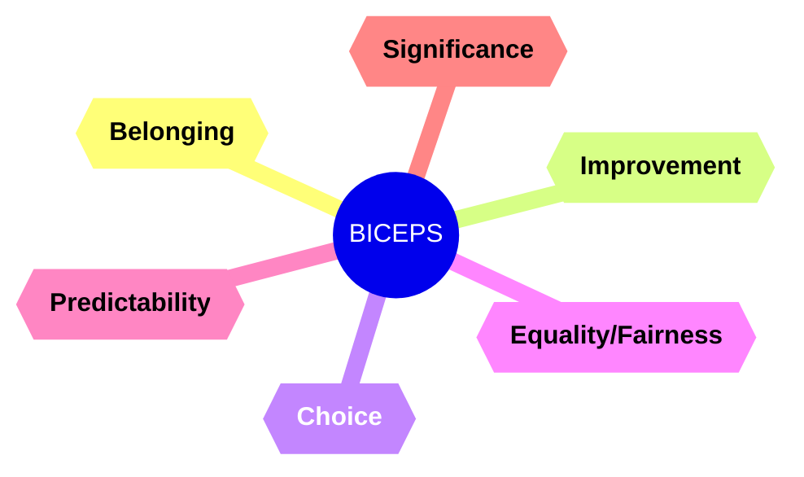

# Core needs: BICEPS

<!--toc:start-->
  - [Introduction](#introduction)
  - [What are the core needs of my team?](#what-are-the-core-needs-of-my-team%3F)
      - [Example questions for 1 to 1s](#example-questions-for-1-to-1s)
      - [Tips for 1 to 1s](#tips-for-1-to-1s)
      - [More coaching questions](#more-coaching-questions)
  - [Definitions](#definitions)
    - [Belonging](#belonging)
    - [Improvement](#improvement)
    - [Choice](#choice)
    - [Equality/Fairness](#equalityfairness)
    - [Predictability](#predictability)
    - [Significance](#significance)
<!--toc:end-->

## Introduction

> _The following is Paloma Medina's [BICEPS model](https://palomamedina.com/biceps), modified and re-formatted slightly for my own use/edification._   

There are six core needs researchers find are important for humans. 
Each of us have a personal hierarchy for the six; you might find equality and belonging are most important to you, 
but choice and significance are more important to your employee, partner, or child. Getting to know them is a 
shortcut to better communication, as well as greater inclusivity at work.

## What are the core needs of my team?

#### Example questions for 1 to 1s  
  - _"What's your favourite project right now? What makes it your favourite?"_
  - _"I've been reading about this BICEPS model and realised one of the core needs I want to focus on right now is_ *____*, _and it made me curious about our team; 
  which do you think matters most to the team right now?"_
  - _"I noticed that at the meeting you asked about_ *____*; _it seems like something you're really passionate about, would you share more about it?"_

#### Tips for 1 to 1s
  - *ALWAYS* confirm with them that your inference is correct: _"So, it seems like one big concern for you right now is how unpredictable things are; does that sound right?"_ 

  - Ask them to *__expand__* so you can understand the *__underlying__* core needs. If they say "Ugh, my project is going fine I guess..." ask them to expand:  
  _"Can you speak more to that...?"_ or _"Hmm...what do you wish was going better about it?"_

  - Check your tone and non-verbal communication.  
  The right tone and body language matter more than the words you say. I promise. So check your tone and body language so that it truly conveys that you care what they say and 
  are genuinely interested in their core needs.

  - **Conflict = Data**  
    When you get in a conflict or negative space with someone at work, **don't** get defensive. This likely speaks to their core needs. Instead of getting defensive, get curious.  

    Conflict or resistance is the clearest indication that the issue or problem hits on something the person really cares about -- when they're saying _No_, what are they saying _Yes_ to? 
    Use open questions and make more time to listen to what they're saying so you can leverage the opportunity to get to the heart of what matters most to them, 
    which is critical for effective communication and problem solving.

#### More coaching questions
For more coaching questions to incorporate into 1:1s and get to know others' core needs better see:
- [Coaching Questions](./biceps-coaching-questions.md)

## Definitions

### Belonging
- Community: A feeling of friendship and closeness with a group, or being part of a tight community of any size.
- Community well-being: People are cared for; the whole group feels happy and healthy.
- Connection: Feeling kinship and mutual understanding with another person.

### Improvement
- Progress: Your daily work created progress towards an important goal for the company, your team, or your own career/life.
- Improving the lives of others: You see how your work helps improve things for others.
- Personal growth: Learning/seeing fast growth in yourself in skills that matter to you.

### Choice
- Choice: Having flexibility, the chance to have more control over key parts of your world.
- Autonomy: Having clear ownership over a domain where you can do as you wish, without asking for permission.
- Decision-making: The ability to make decisions about the things that matter to you.

### Equality/Fairness
- Access to resources (money, time, space, etc.) feels fair/equitable.
- Access to information feels fair: All groups/people have access to information that is relevant to them. 
- Equal reciprocity: You support each other equally.
- Decisions are fair and everyone is treated as equally important.

### Predictability
- Resources: There's enough certainty about resources (money, personnel hours, space) so that you can focus on your job or goals.
- Time: There's certainty about when things will occur/when you can prepare for them.
- Future challenges: You can anticipate and thus prepare for future challenges.
- Direction: Goals, strategy, and direction stay consistent and don't change too often/fast.

### Significance
- Your work feels like it has a clear sense of purpose.
- You see how you or your work fit into a positive goal or mission.
- You feel part of an important, positive movement or group.

